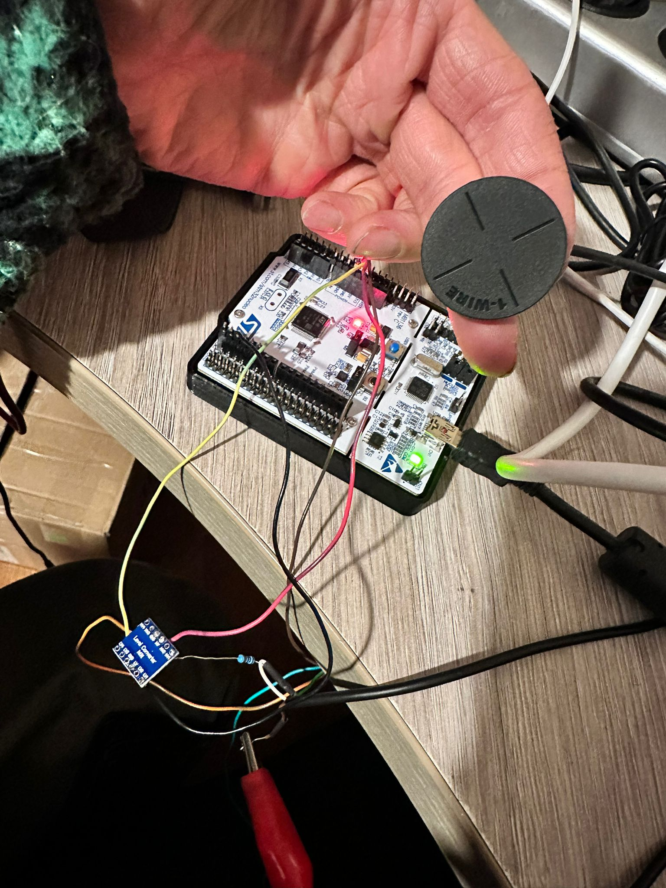
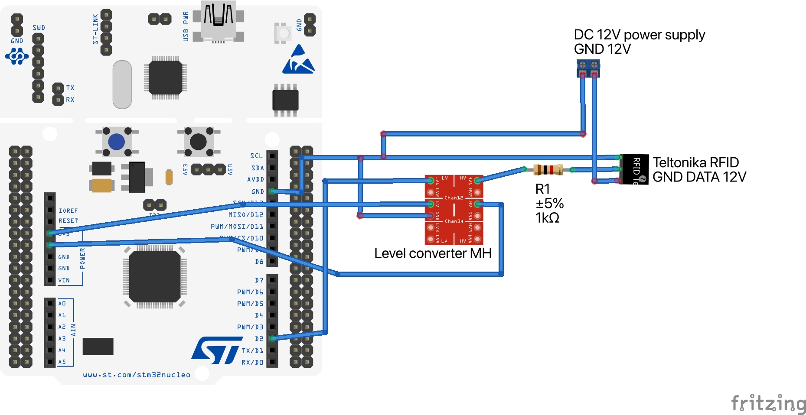
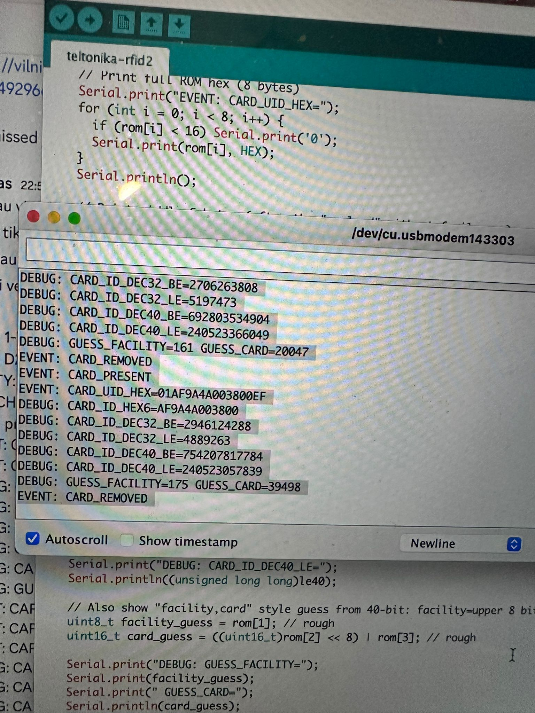

# Teltonika 1-Wire RFID Reader → STM32 (Arduino IDE)

## Overview

This repository documents a **safe, deterministic, and production-ready integration of a Teltonika 1-Wire RFID reader with an STM32 Nucleo board**, implemented using Arduino IDE (STM32duino).

The project focuses on:
- understanding real-world behavior of Teltonika 1-Wire RFID readers,
- handling automotive voltage domains safely,
- implementing a correct 1-Wire master (open-drain discipline),
- extracting the **actual RFID card UID** without undocumented assumptions.

This is not a generic tutorial.  
It is an engineering write-up based on **measurement, debugging, and protocol analysis**.

---

## Background / Motivation

Teltonika 1-Wire RFID readers are designed primarily for telematics and vehicle tracking devices.  
The official documentation states that the reader:
- uses the 1-Wire protocol,
- emulates an iButton device,
- supports `Read ROM (0x33)` and `Search ROM (0xF0)`.

What is **not explicitly documented**:
- whether the ROM represents the reader or the card,
- when the reader joins the 1-Wire bus,
- how presence behaves when a card is removed,
- what voltage level is actually present on the DATA line.

This project answers those questions through **controlled experiments** instead of speculation.

---

## Why 1-Wire

The 1-Wire interface was chosen deliberately.

Many RFID solutions rely on USB readers, which introduce:
- USB stacks and drivers,
- CDC / HID abstractions,
- operating system dependencies,
- non-deterministic behavior in embedded environments.

The goal of this project was the opposite:
- direct control from a simple microcontroller,
- no USB, no drivers, no host OS,
- predictable timing and behavior,
- minimal hardware and software layers.

### Advantages of 1-Wire in This Context

Using 1-Wire allows:
- direct GPIO-level control from the MCU,
- operation without any USB host capability,
- easy integration with low-cost controllers,
- deterministic behavior suitable for real-time systems.

Only one data line plus ground is required, which simplifies:
- wiring,
- EMI considerations,
- deployment in industrial or automotive environments.

### Embedded-First Design

The solution was designed to work with:
- bare-metal firmware,
- simple state machines,
- small MCUs without USB peripherals,
- systems where reliability and control matter more than convenience.

This makes the approach suitable for:
- access control systems,
- smart lockers,
- vehicle identification,
- industrial controllers,
- offline and headless embedded devices.

In short, 1-Wire provides exactly what was needed:
**simple hardware, full control, and no unnecessary abstraction layers.**

---

## Hardware Used

- **Teltonika 1-Wire RFID Reader**
  - Supply voltage: 6.5–30 V (tested with 12 V)
  - 1-Wire DATA interface (iButton emulation)
- **STM32 Nucleo-64** (MB1136, STM32 family MCU)
- **BSS138 bidirectional logic level shifter**



*Teltonika 1-Wire RFID reader used for iButton emulation tests.*


- Passive components:
  - 1 kΩ series resistor on DATA line
- Development environment:
  - Arduino IDE
  - STM32duino core

---

## Why a Level Shifter Is Required

Although the RFID reader is powered from **12 V**, direct measurement showed that:
- the 1-Wire DATA line operates at approximately **5 V**,
- it never rises to 12 V.

However:
- STM32 GPIOs are **3.3 V tolerant only**,
- 1-Wire is an **open-drain bus**,
- driving HIGH is forbidden.

The chosen solution:
- **BSS138 bidirectional level shifter**
- HV = 5 V
- LV = 3.3 V
- common GND

This ensures:
- voltage domain separation,
- correct open-drain behavior,
- no current injection into STM32 protection diodes.

---

## Electrical Connection

### Power Connections

- RFID Brown → +12 V
- RFID Green → GND
- STM32 GND → common ground
- Level shifter:
  - HV → STM32 5V
  - LV → STM32 3V3
  - GND → common ground





### Data Path

```
RFID DATA (White)
        |
      [1 kΩ]
        |
     HV1 (level shifter)
        |
     BSS138 MOSFET
        |
     LV1
        |
   STM32 D2 (PA10)
```

### Critical Electrical Rules

- STM32 GPIO **never drives HIGH**
- HIGH state = GPIO configured as INPUT (Hi-Z)
- LOW state = GPIO OUTPUT LOW
- HV must **never** be connected to 12 V
- All grounds must be common

---

## Architecture Overview

The system is intentionally split into three layers:

### 1. Power & Signal Safety Layer
- Handles voltage domain separation
- Protects MCU GPIOs
- Ensures correct electrical behavior

### 2. Protocol Layer (1-Wire Master)
- Bit-banged implementation
- Strict open-drain discipline
- Timing validated against real hardware

### 3. Application Layer
- Card presence detection
- UID change detection
- Human-readable ID extraction

### Data Flow

RFID Card  
→ Teltonika Reader (iButton emulation)  
→ 1-Wire bus  
→ Level Shifter (5 V → 3.3 V)  
→ STM32 GPIO  
→ UID processing  
→ Serial output / application logic

---

## Software Environment

- Arduino IDE
- STM32duino core
- No external 1-Wire libraries
- Fully custom bit-banged 1-Wire master

GPIO assignment:
- **D2 (PA10)** → 1-Wire DATA

---

## Testing Strategy

### Electrical Validation
- Verified:
  - HV ≈ 5.0 V
  - LV ≈ 3.3 V
- Confirmed DATA never reaches 12 V


### 1-Wire Functional Testing
- No card present:
  - No presence pulse
- Card presented:
  - Presence detected
  - Read ROM succeeds
- Card removed:
  - Presence disappears

This confirmed that the reader **only joins the 1-Wire bus while a card is present**.



---

## Key Finding

**The Teltonika reader exposes the actual RFID card UID via the 1-Wire ROM.**

This was confirmed by:
- testing multiple different cards,
- observing ROM changes,
- validating CRC on every read.

Example:

```
Card A:
01 A1 4E 4F 00 38 00 3C

Card B:
01 AF 9A 4A 00 38 00 EF
```

Therefore:
- `Read ROM (0x33)` is sufficient,
- no additional memory commands are required.

---

## Card Number Interpretation

Printed numbers on 125 kHz RFID cards are typically decimal representations.

Testing showed that:
- the printed card number corresponds to **ROM bytes 1..4 interpreted as little-endian (`DEC32_LE`)**.

The code intentionally keeps multiple representations available:
- HEX ROM
- DEC32 little-endian
- DEC32 big-endian
- DEC40 variants

This allows future support for different card formats without hardware changes.

---

## Challenges & Solutions

### Unknown Reader Behavior
Solved by:
- systematic ROM and endian analysis,
- CRC validation,
- multi-card comparison.

### Automotive Voltage Environment
Solved by:
- series resistor,
- level shifter,
- strict open-drain discipline.

### Initial Presence Instability
Solved by:
- reducing redundant bus resets,
- implementing event-based state handling.

---

## Result

The final solution is:
- electrically safe,
- protocol-correct,
- deterministic,
- suitable for production embedded systems.

---

## Usage Examples

This solution is intentionally generic and can be reused in multiple embedded and industrial scenarios where a simple, reliable RFID identification is required.

### 1. Smart Lockers and Asset Locking Systems
The solution is well suited for smart locker and asset protection systems, where a physical RFID card acts as a secure and simple authentication token.

Typical use cases include:
- parcel lockers,
- tool and equipment lockers,
- employee personal storage,
- shared asset management systems.

The STM32 reads the RFID card UID and can:
- unlock a specific locker assigned to the card,
- validate access against a centralized or local database,
- log access events (open/close, time, user),
- support offline operation with locally stored credentials.

Due to the deterministic behavior and open-drain 1-Wire implementation, the system can be safely deployed in:
- industrial environments,
- public-access installations,
- outdoor or semi-outdoor lockers.

The RFID card serves as a robust alternative to PIN codes or touchscreens, reducing maintenance and improving reliability.

### 2. Driver Identification in Vehicles
The original use case for Teltonika 1-Wire RFID readers.

Each RFID card represents a driver.  
The STM32 reads the card UID and can:
- allow or deny vehicle ignition,
- associate trips with a specific driver,
- log driver activity to flash memory or send it via CAN / UART / GSM.

### 3. Access Control for Embedded Devices
The reader can be used as a lightweight access control mechanism for:
- industrial controllers,
- machines with restricted operation,
- service or maintenance panels.

The UID can be compared against a whitelist stored in:
- internal Flash,
- EEPROM,
- external memory.

### 4. Time & Attendance / Presence Tracking
By detecting `CARD_PRESENT` and `CARD_REMOVED` events, the system can:
- register entry and exit times,
- track working hours,
- trigger external systems via serial, RS485, or Ethernet gateways.

### 5. Secure Configuration or Service Mode
An RFID card can act as a physical key to:
- enter service mode,
- unlock configuration menus,
- enable firmware update mode.

This is especially useful in headless embedded systems without displays or keyboards.

### 6. Industrial or Agricultural Equipment Identification
The system can be used to identify:
- operators of heavy machinery,
- authorized personnel for agricultural equipment,
- machine-to-user binding in distributed environments.

### 7. Prototyping and Reverse Engineering
Because the implementation exposes raw 1-Wire behavior and UID formats, it is well suited for:
- analyzing unknown RFID readers,
- testing card formats,
- reverse engineering legacy access systems.

---

## Integration Notes

### Communication and System Integration

- The output UID can be easily forwarded to:
  - CAN bus,
  - RS485 / Modbus,
  - Ethernet / MQTT gateway,
  - GSM / LTE modem.

- The solution is MCU-agnostic and can be ported to:
  - STM32CubeIDE,
  - bare-metal projects,
  - RTOS-based systems.

### Actuators and Physical Control

The RFID UID can be directly used to control physical devices such as locks, relays, and actuators.

Typical integrations include:
- relay modules for door or cabinet unlocking,
- transistor or MOSFET drivers for solenoids and electric strikes,
- smart locker door control mechanisms,
- motor drivers for mechanical latching systems.

Common control methods:
- GPIO-driven relay modules,
- low-side or high-side transistor switching,
- opto-isolated relay boards for noisy environments.

### Locking and Safety Considerations

When controlling locks or actuators, the following best practices are recommended:
- use flyback diodes when driving inductive loads,
- separate logic and actuator power domains where possible,
- prefer opto-isolation in industrial or automotive installations,
- implement fail-safe behavior (locked or unlocked on power loss, depending on use case).

The RFID system provides authentication, while the final access decision and actuator control remain fully under firmware control.

---

## Notes

This project was developed through hands-on experimentation and real hardware testing.

If you are working on a similar integration or exploring 1-Wire RFID readers in embedded systems, feel free to use this repository as a reference or starting point.


---

## License

MIT License. See LICENSE file for details.
